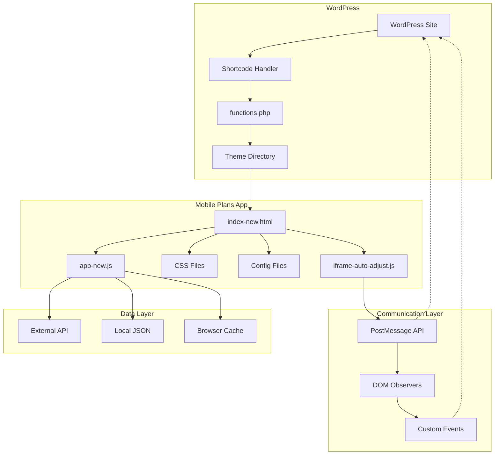

# 🏗️ ARQUITECTURA DEL SISTEMA - Mobile Plans

## 🎯 **Visión General**

Mobile Plans utiliza una arquitectura híbrida que combina una aplicación JavaScript standalone con integración WordPress mediante iframe dinámico. Esta aproximación mantiene la independencia del desarrollo frontend mientras proporciona una integración nativa en WordPress.

---

## 📊 **Diagrama de Arquitectura**



---

## 🔧 **Componentes Principales**

### **🌐 WordPress Layer**

#### **Shortcode Handler**
```php
mobile_plans_dynamic_iframe_shortcode($atts)
```
- **Responsabilidad:** Generar iframe dinámico con configuración
- **Entrada:** Parámetros de shortcode (`height`, `min_height`)
- **Salida:** HTML + CSS + JavaScript para iframe
- **Características:**
  - Loading animado
  - Comunicación PostMessage
  - Responsive automático
  - Debug integrado

#### **Integration Layer**
```php
functions.php integration
```
- **Responsabilidad:** Registrar shortcodes y funciones helper
- **Componentes:**
  - Shortcode registration
  - Debug functions
  - Helper utilities
  - Error handling

---

### **📱 Application Layer**

#### **Core Application**
```javascript
// app-new.js
class MobilePlansApp
```
- **Responsabilidad:** Lógica principal de la aplicación
- **Características:**
  - Gestión de estado
  - Navegación entre secciones
  - Carga y filtrado de productos
  - Comparación de planes
  - Calculadora de recomendaciones

#### **Component System**
```javascript
// js/components/
NavigationMinimal.js
FilterSystemNew.js  
ProductCardNew.js
Calculator.js
Comparator.js
```
- **Arquitectura:** Component-based modular
- **Patrón:** Factory + Observer
- **Comunicación:** Event-driven

#### **Data Management**
```javascript
// js/stores/
products.js     // Estado de productos
filters.js      // Estado de filtros
comparison.js   // Estado de comparación
```
- **Patrón:** Store pattern (similar a Redux)
- **Características:**
  - Estado centralizado
  - Immutable updates
  - Event notifications

#### **Utilities**
```javascript
// js/utils/
api.js          // Gestión de API
cache.js        // Sistema de caché
animations.js   // Animaciones
```
- **Responsabilidad:** Funcionalidades transversales
- **Principios:** Single responsibility, reusabilidad

---

### **🔗 Communication Layer**

#### **Iframe Auto-adjust System**
```javascript
// js/iframe-auto-adjust.js
```
- **Responsabilidad:** Comunicación bidireccional iframe ↔ WordPress
- **Protocolo PostMessage:**
  ```javascript
  // From iframe to parent
  {
    type: 'mobile-plans-resize',
    height: 850,
    timestamp: 1640995200000
  }
  
  // From parent to iframe  
  {
    type: 'mobile-plans-request-height'
  }
  ```

#### **Observer System**
```javascript
// DOM Observers
MutationObserver    // Detecta cambios en contenido
ResizeObserver     // Detecta cambios de tamaño
```
- **Responsabilidad:** Detectar cambios que afecten altura
- **Triggers:**
  - Adición/eliminación de elementos
  - Cambios de estilo/clase
  - Resize de ventana
  - Carga de contenido dinámico

---

### **💾 Data Layer**

#### **API Integration**
```javascript
// Primary: External API
https://ipv6-informatica.es/cart/data/products.json

// Fallback: Local JSON
config/products-enhanced.json
```
- **Estrategia:** External-first con fallback local
- **Caching:** Browser cache + transients
- **Error handling:** Graceful degradation

#### **Data Flow**
```
API Request → Validation → Transform → Cache → Render
     ↓
Fallback Local → Validation → Transform → Cache → Render
```

---

## 🎨 **Design Patterns**

### **🏭 Factory Pattern**
```javascript
// Component creation
ComponentFactory.create('ProductCard', config)
ComponentFactory.create('FilterSystem', config)
```
- **Uso:** Creación de componentes dinámicos
- **Beneficio:** Flexibilidad y reutilización

### **👁️ Observer Pattern**
```javascript
// Event system
EventBus.on('products.loaded', handler)
EventBus.on('filters.changed', handler)
EventBus.on('comparison.updated', handler)
```
- **Uso:** Comunicación entre componentes
- **Beneficio:** Loose coupling, scalabilidad

### **🏪 Store Pattern**
```javascript
// Centralized state management
const ProductStore = {
    state: { products: [], filters: {}, loading: false },
    getProducts: () => state.products,
    setProducts: (products) => { /* immutable update */ },
    subscribe: (callback) => { /* observer registration */ }
}
```
- **Uso:** Gestión de estado global
- **Beneficio:** Predictabilidad, debugging

### **🎭 Strategy Pattern**
```javascript
// Different rendering strategies
const RenderStrategy = {
    catalog: CatalogRenderer,
    comparison: ComparisonRenderer,
    calculator: CalculatorRenderer
}
```
- **Uso:** Diferentes modos de visualización
- **Beneficio:** Extensibilidad, mantenimiento

---

## 🔄 **Data Flow Architecture**

### **Application Lifecycle**
```
1. WordPress loads → 2. Shortcode renders → 3. Iframe created
                                               ↓
7. User interaction ← 6. UI updates ← 5. Components render ← 4. App initializes
        ↓
8. State changes → 9. Store updates → 10. Event emission → 11. Re-render
```

### **Component Communication**
```javascript
// Unidirectional data flow
User Action → Component → Store → Event → UI Update

// Example:
FilterChange → FilterSystem → ProductStore → 'products.filtered' → ProductGrid
```

### **Height Adjustment Flow**
```
Content Change → DOM Observer → Height Calculation → PostMessage → WordPress → Iframe Resize
```

---

## 🛡️ **Security Architecture**

### **Isolation Strategy**
- **Same-origin policy:** Iframe y parent en mismo dominio
- **PostMessage validation:** Verificación de origen
- **Content Security Policy:** Headers apropiados
- **Input sanitization:** Validación en frontend y backend

### **Data Security**
```javascript
// Input validation
function validateProductData(data) {
    return {
        id: sanitizeString(data.id),
        name: sanitizeString(data.name),
        price: sanitizeNumber(data.price),
        // ... more validation
    }
}
```

---

## 📈 **Performance Architecture**

### **Lazy Loading Strategy**
```javascript
// Components loaded on demand
const LazyLoader = {
    loadComponent: async (name) => {
        if (!loadedComponents[name]) {
            loadedComponents[name] = await import(`./components/${name}.js`);
        }
        return loadedComponents[name];
    }
}
```

### **Caching Strategy**
```
Level 1: Memory Cache (runtime)
Level 2: Browser Cache (localStorage/sessionStorage)  
Level 3: WordPress Transients
Level 4: External API Cache-Control headers
```

### **Optimization Techniques**
- **CSS-in-JS:** Estilos críticos inline
- **Resource hints:** dns-prefetch, preconnect
- **Bundle optimization:** Tree shaking, minification
- **Image optimization:** WebP, responsive images
- **Script optimization:** Async/defer loading

---

## 🔧 **Development Architecture**

### **Build Process**
```
Source Files → Validation → Optimization → Testing → Deployment
     ↓
ES6+ → Babel → Minification → QA → Production
CSS → PostCSS → Autoprefixer → Minification → CDN
```

### **Environment Configuration**
```javascript
const CONFIG = {
    development: {
        api: 'http://localhost/api',
        debug: true,
        cache: false
    },
    production: {
        api: 'https://ipv6-informatica.es/cart/data/products.json',
        debug: false,
        cache: true
    }
}
```

### **Error Handling Strategy**
```javascript
// Hierarchical error handling
Application Level → Component Level → UI Level → User Feedback

// Example:
API Error → Store Error Handler → Component Error State → User Message
```

---

## 🚀 **Deployment Architecture**

### **WordPress Integration**
```
WordPress Site
├── Theme Directory
│   └── mobile-plans/
│       ├── Application Files
│       └── Configuration
└── functions.php
    └── Integration Code
```

### **CDN Strategy**
```
Static Assets → CDN (images, fonts, icons)
Application Code → Local hosting (WordPress)
External APIs → Direct connection with fallback
```

### **Versioning Strategy**
```
Semantic Versioning (MAJOR.MINOR.PATCH)
- MAJOR: Breaking changes
- MINOR: New features, backward compatible  
- PATCH: Bug fixes, backward compatible
```

---

## 🔮 **Future Architecture Considerations**

### **Scalability Roadmap**
1. **Multi-instance Support:** Múltiples widgets en misma página
2. **Plugin Architecture:** Sistema de plugins extensible
3. **API Gateway:** Abstracción de múltiples APIs
4. **Micro-frontend:** Separación completa de componentes

### **Technology Evolution**
1. **Web Components:** Migración a estándares web
2. **Service Workers:** Caching avanzado y offline support
3. **Progressive Web App:** Instalabilidad y funciones nativas
4. **GraphQL:** API más eficiente y flexible

---

**🎯 Esta arquitectura proporciona una base sólida, escalable y mantenible para Mobile Plans, permitiendo evolución continua sin comprometer la estabilidad.**

*Para detalles de implementación, ver [ESTRUCTURA-ARCHIVOS.md](./ESTRUCTURA-ARCHIVOS.md)*