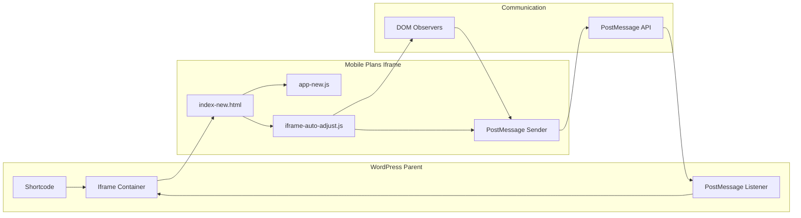

# 📐 SISTEMA DE IFRAME DINÁMICO - Mobile Plans

## 🎯 **Concepto General**

El sistema de iframe dinámico permite que una aplicación JavaScript independiente se integre perfectamente en WordPress, ajustando automáticamente su altura al contenido real sin scrolls, manteniendo una experiencia visual nativa.

---

## 🔧 **Arquitectura del Sistema**

### **Componentes Principales**



---

## 📡 **Protocolo de Comunicación**

### **Mensajes del Iframe al Padre**

#### **Resize Message**
```javascript
// Enviado cuando cambia la altura del contenido
{
    type: 'mobile-plans-resize',
    height: 850,                    // Nueva altura en píxeles
    timestamp: 1640995200000,       // Timestamp para debugging
    url: 'https://site.com/...'     // URL del iframe para identificación
}
```

#### **Content Loaded Message**
```javascript
// Enviado cuando el contenido inicial está listo
{
    type: 'mobile-plans-content-loaded',
    timestamp: 1640995200000
}
```

### **Mensajes del Padre al Iframe**

#### **Height Request**
```javascript
// Solicitar altura actual del contenido
{
    type: 'mobile-plans-request-height'
}
```

---

## 🎛️ **Detección Automática de Iframe**

### **Mecanismo de Detección**
```javascript
// En index-new.html
if (window.self !== window.top) {
    console.log('📱 Mobile Plans: Detectado iframe, cargando auto-ajuste...');
    const script = document.createElement('script');
    script.src = './js/iframe-auto-adjust.js';
    script.async = true;
    document.head.appendChild(script);
} else {
    console.log('📱 Mobile Plans: Ejecutándose standalone');
}
```

**Características:**
- ✅ **Carga condicional:** Solo se activa en iframe
- ✅ **Sin overhead:** Cero impacto en modo standalone
- ✅ **Carga asíncrona:** No bloquea la aplicación principal

---

## 📏 **Sistema de Cálculo de Altura**

### **Algoritmo de Medición**
```javascript
function calculateRealHeight() {
    const body = document.body;
    const html = document.documentElement;
    
    // Forzar recálculo de estilos
    body.style.display = 'none';
    body.offsetHeight; // Force reflow
    body.style.display = '';
    
    // Obtener todas las métricas posibles
    const heights = [
        body.scrollHeight,           // Altura del scroll completo
        body.offsetHeight,           // Altura visible + padding
        html.clientHeight,           // Altura del viewport
        html.scrollHeight,           // Altura total del documento
        html.offsetHeight            // Altura total incluyendo borders
    ];
    
    // También considerar el último elemento visible
    const lastElement = body.lastElementChild;
    if (lastElement) {
        const rect = lastElement.getBoundingClientRect();
        heights.push(rect.bottom + 20); // + padding extra
    }
    
    return Math.ceil(Math.max(...heights));
}
```

**Estrategia Multi-métrica:**
- 📊 **5 mediciones diferentes** para máxima precisión
- 🔧 **Force reflow** para obtener valores reales
- 📐 **Último elemento** como referencia adicional
- ➕ **Padding extra** para evitar cortes

---

## 👁️ **Sistema de Observación de Cambios**

### **MutationObserver**
```javascript
const observer = new MutationObserver(function(mutations) {
    let shouldResize = false;
    
    mutations.forEach(function(mutation) {
        if (mutation.type === 'childList' && 
            (mutation.addedNodes.length > 0 || mutation.removedNodes.length > 0)) {
            shouldResize = true;
        } else if (mutation.type === 'attributes' && 
                  (mutation.attributeName === 'style' || 
                   mutation.attributeName === 'class')) {
            shouldResize = true;
        }
    });
    
    if (shouldResize) {
        setTimeout(adjustHeight, 300); // Debounced
    }
});

observer.observe(document.body, {
    childList: true,        // Cambios en elementos hijos
    subtree: true,          // Observar todo el árbol
    attributes: true,       // Cambios de atributos
    attributeFilter: ['style', 'class', 'hidden']
});
```

### **ResizeObserver**
```javascript
if (window.ResizeObserver) {
    const resizeObserver = new ResizeObserver(function(entries) {
        setTimeout(adjustHeight, 200);
    });
    
    resizeObserver.observe(document.body);
    resizeObserver.observe(document.documentElement);
}
```

**Triggers de Reajuste:**
- 📝 **DOM changes:** Adición/eliminación de elementos
- 🎨 **Style changes:** Modificaciones de CSS
- 📐 **Resize events:** Cambios de tamaño de ventana
- 🔄 **Content updates:** Carga de contenido dinámico

---

## 🎨 **Optimización de Estilos para Iframe**

### **CSS Específico para Iframe**
```css
/* Aplicado automáticamente cuando está en iframe */
html, body {
    margin: 0 !important;
    padding: 0 !important;
    overflow-x: hidden !important;
    box-sizing: border-box !important;
}

body {
    min-height: auto !important;
    height: auto !important;
    background: transparent !important;
}

/* Ajustar contenedor principal */
.main-content {
    padding: 15px !important;
    margin: 0 !important;
    max-width: 100% !important;
    overflow: hidden !important;
}

/* Grid responsivo optimizado */
.products-grid {
    display: grid !important;
    grid-template-columns: repeat(auto-fit, minmax(280px, 1fr)) !important;
    gap: 15px !important;
    margin: 15px 0 !important;
    padding: 0 !important;
}

/* Ocultar scrollbars */
::-webkit-scrollbar {
    display: none !important;
}

* {
    -ms-overflow-style: none !important;
    scrollbar-width: none !important;
}
```

**Optimizaciones Aplicadas:**
- 🚫 **Sin márgenes externos** que causen espacios
- 📱 **Grid optimizado** para contenedores estrechos
- 📐 **Padding reducido** para maximizar espacio
- 🔄 **Overflow controlado** para evitar scrolls
- 👻 **Scrollbars ocultos** en todos los navegadores

---

## ⏱️ **Sistema de Timing y Performance**

### **Estrategia de Ajuste Escalonado**
```javascript
// Ajustes iniciales en momentos clave
setTimeout(() => adjustHeight(), 500);   // Post-inicialización
setTimeout(() => adjustHeight(), 1000);  // Post-carga de componentes
setTimeout(() => adjustHeight(), 2000);  // Post-carga de datos
setTimeout(() => adjustHeight(), 3000);  // Post-renderizado completo

// Verificación periódica como backup
setInterval(checkAndSendHeight, 2000);   // Cada 2 segundos
```

### **Debounced Updates**
```javascript
let resizeTimeout;

function adjustHeight() {
    clearTimeout(resizeTimeout);
    
    resizeTimeout = setTimeout(() => {
        const currentHeight = calculateRealHeight();
        
        // Solo enviar si hay cambio significativo (>10px)
        if (Math.abs(currentHeight - lastHeight) > 10) {
            lastHeight = currentHeight;
            sendHeightToParent(currentHeight);
        }
    }, 100);  // 100ms debounce
}
```

**Optimizaciones de Performance:**
- ⏱️ **Debouncing** para evitar cálculos excesivos
- 🎯 **Threshold filtering** (>10px) para cambios significativos
- 📊 **Timing estratégico** en momentos clave del lifecycle
- 🔄 **Periodic backup** para casos edge

---

## 🛡️ **Manejo de Errores y Fallbacks**

### **Detección de Fallos de Comunicación**
```javascript
// Timeout si no hay comunicación
setTimeout(() => {
    if (!isReady) {
        console.log('⚠️ Mobile Plans: Fallback - mostrando iframe sin comunicación');
        loading.style.display = 'none';
        iframe.style.opacity = '1';
        isReady = true;
    }
}, 5000);  // 5 segundos máximo de loading
```

### **Fallback para Browsers Antiguos**
```javascript
// Si PostMessage no está disponible
if (typeof window.postMessage !== 'function') {
    console.warn('PostMessage no soportado, usando fallback');
    
    // Usar polling como alternativa
    setInterval(() => {
        const height = calculateRealHeight();
        if (window.parent && window.parent.mobilePlansHeightCallback) {
            window.parent.mobilePlansHeightCallback(height);
        }
    }, 1000);
}
```

### **Error Handling Robusto**
```javascript
try {
    sendHeightToParent(currentHeight);
} catch (error) {
    console.error('Error enviando altura:', error);
    
    // Fallback method
    if (window.parent) {
        try {
            window.parent.document.querySelector('#iframe-id').style.height = currentHeight + 'px';
        } catch (fallbackError) {
            console.warn('Fallback también falló:', fallbackError);
        }
    }
}
```

---

## 📊 **Métricas y Monitoring**

### **Logs Detallados**
```javascript
// Sistema de logging estructurado
const Logger = {
    info: (message, data) => console.log(`📏 Mobile Plans: ${message}`, data),
    warn: (message, data) => console.warn(`⚠️ Mobile Plans: ${message}`, data),
    error: (message, data) => console.error(`❌ Mobile Plans: ${message}`, data)
};

// Ejemplos de uso:
Logger.info('Altura calculada', { height: 850, method: 'scrollHeight' });
Logger.warn('Reintentando comunicación', { attempt: 3, maxAttempts: 5 });
Logger.error('PostMessage falló', { error: error.message });
```

### **Performance Tracking**
```javascript
// Medir tiempo de ajuste
const startTime = performance.now();
adjustHeight();
const endTime = performance.now();
Logger.info(`Ajuste completado en ${endTime - startTime}ms`);

// Tracking de eventos
const metrics = {
    adjustments: 0,
    averageHeight: 0,
    lastUpdate: Date.now()
};
```

---

## 🔧 **API de Debug**

### **Funciones Globales de Debug**
```javascript
// Disponibles en window para debugging
window.mobilePlansIframeDebug = {
    getCurrentHeight: () => calculateRealHeight(),
    sendHeight: () => sendHeightToParent(getCurrentHeight()),
    forceResize: () => adjustHeight(),
    getMetrics: () => metrics,
    enableVerboseLogging: () => { verboseMode = true; }
};
```

### **WordPress Debug Functions**
```javascript
// Disponibles en la página padre
window.mobilePlansDebugIframe = function(iframeId) {
    // Debug específico de iframe
};

window.mobilePlansResizeAll = function() {
    // Reajustar todos los iframes
};
```

---

## 🚀 **Optimizaciones Futuras**

### **Roadmap de Mejoras**
1. **Intersection Observer:** Ajustar solo cuando es visible
2. **Web Workers:** Cálculos de altura en background thread
3. **CSS Container Queries:** Ajustes automáticos vía CSS
4. **ResizeObserver v2:** Mejor detección de cambios

### **Tecnologías Emergentes**
```javascript
// Próxima implementación con Container Queries
@container iframe-container (min-height: 600px) {
    .mobile-plans-container {
        /* Ajustes automáticos */
    }
}
```

---

**🎯 El sistema de iframe dinámico proporciona una experiencia perfecta, transparente para el usuario final, con altura automática y comunicación robusta entre aplicación y WordPress.**

*Para detalles de implementación, ver [COMUNICACION-WORDPRESS.md](./COMUNICACION-WORDPRESS.md)*